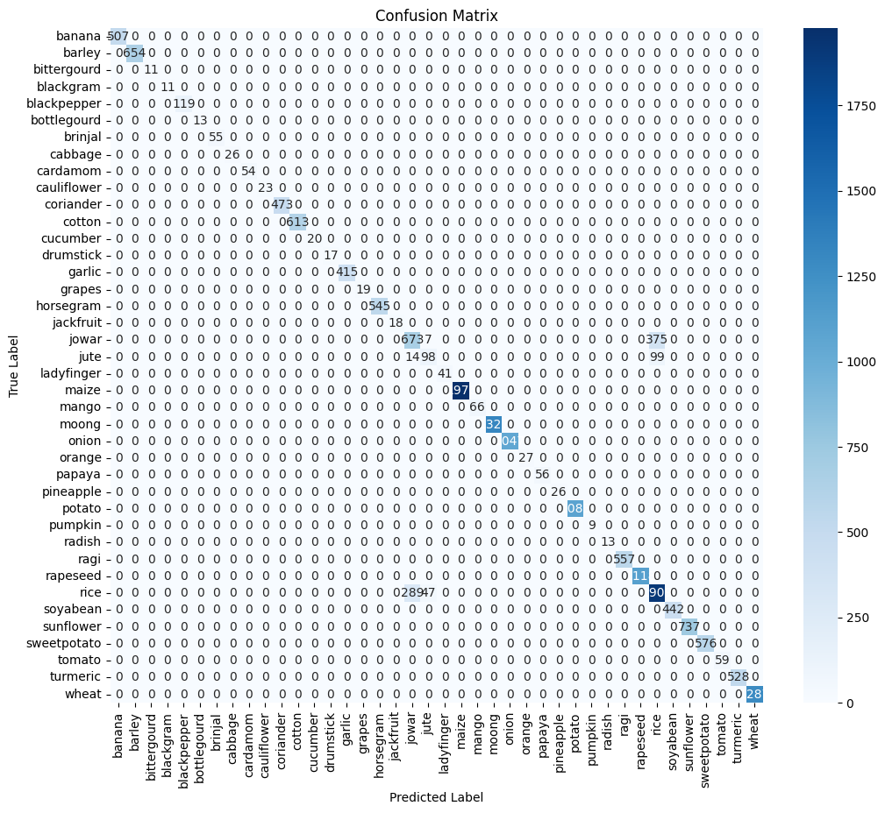
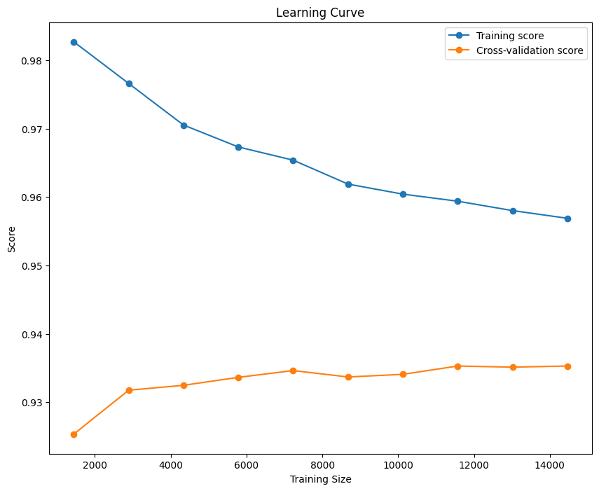
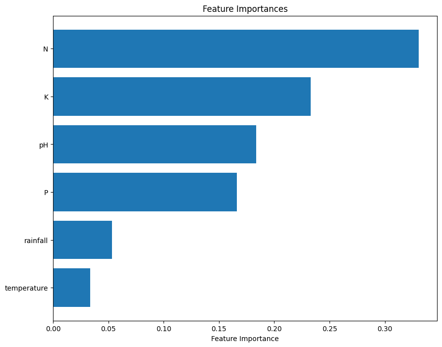
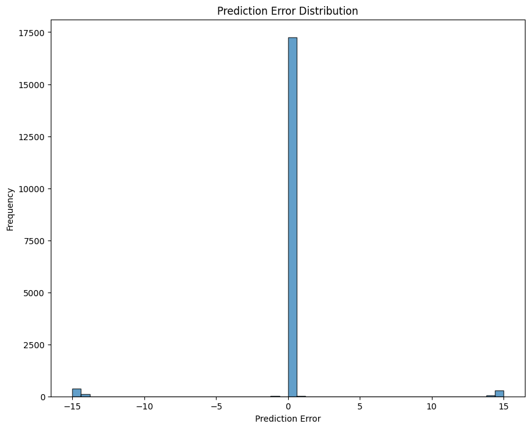

# Crop-Recommendation-System

**Author: Ayush Shukla**
**License: MIT License**

# Overview
- This project presents a Crop Recommendation System using machine learning model Random Forest Classification, aimed at providing accurate crop recommendations based on various environmental and soil factors. The system has been built with high accuracy and includes multiple visual tools to assess its performance.

- The dataset used for this project is sourced from IEEE Data Port, provided by **Suyash Gholap, Harsh Singh, Rohan Rajesh, and Shweta Barshe**, licensed under Creative Commons Attribution.
- SuyashGholapHarshSinghRohanRajeshShwetaBarshe
- Submitted by: Suyash Gholap
- Last updated: Fri, 06/21/2024
- DOI: 10.21227/3ays-5h79

# Features
- **Accuracy: 95.50%**
- Precision, Recall, F1-Score:High performance across all classes, with notable results for challenging categories like class 33 and class 18.
- Confusion Matrix, Learning Curve, Feature Importance, and Prediction Error Distribution charts to visually understand the model's performance.
- Classification Report: Provides detailed per-class metrics.

# Table of Contents
Getting Started
Installation
Model Performance
Usage
License

# Getting Started
**Prerequisites**
 - Python 3.7+
 - Jupyter Notebook (optional for exploration)

**Required libraries:**
 - pandas
 - scikit-learn
 - matplotlib
 - seaborn
 - numpy

You can install the necessary dependencies by running:
`pip install -r requirements.txt`.

# Model Performance
# Overall Accuracy
The model achieved an overall accuracy of 95.50%, as shown in the confusion matrix and classification report.

Accuracy: 95.50%
Classification Report:
               precision    recall  f1-score   support

           0       1.00      1.00      1.00       507
           1       1.00      1.00      1.00       654
           2       1.00      1.00      1.00        11
           3       1.00      1.00      1.00        11
           4       1.00      1.00      1.00       119
           5       1.00      1.00      1.00        13
           6       1.00      1.00      1.00        55
           7       1.00      1.00      1.00        26
           8       1.00      1.00      1.00        54
           9       1.00      1.00      1.00        23
          10       1.00      1.00      1.00       473
          11       1.00      1.00      1.00       613
          12       1.00      1.00      1.00        20
          13       1.00      1.00      1.00        17
          14       1.00      1.00      1.00       415
          15       1.00      1.00      1.00        19
          16       1.00      1.00      1.00       545
          17       1.00      1.00      1.00        18
          18       0.69      0.65      0.67      1055
          19       0.61      0.54      0.57       211
          20       1.00      1.00      1.00        41
          21       1.00      1.00      1.00      1976
          22       1.00      1.00      1.00        66
          23       1.00      1.00      1.00      1327
          24       1.00      1.00      1.00      1047
          25       1.00      1.00      1.00        27
          26       1.00      1.00      1.00        56
          27       1.00      1.00      1.00        26
          28       1.00      1.00      1.00      1083
          29       1.00      1.00      1.00         9
          30       1.00      1.00      1.00        13
          31       1.00      1.00      1.00       557
          32       1.00      1.00      1.00      1118
          33       0.81      0.84      0.83      2245
          34       1.00      1.00      1.00       442
          35       1.00      1.00      1.00       737
          36       1.00      1.00      1.00       576
          37       1.00      1.00      1.00        59
          38       1.00      1.00      1.00       528
          39       1.00      1.00      1.00      1287

    accuracy                            0.95     18079
    macro avg       0.98      0.98      0.98     18079
    weighted avg    0.95      0.95      0.95     18079

# Confusion Matrix

The confusion matrix shows the distribution of correct and incorrect predictions across different categories. Most of the misclassifications occur in challenging classes like 18 and 33.

Learning Curve
 

The learning curve indicates that the model performs consistently as the training size increases. A small gap between training and cross-validation scores indicates minimal overfitting.

Feature Importance
 

This graph shows the importance of different features (such as soil pH, temperature, etc.) in making accurate predictions. Higher bars indicate more influential features.

Prediction Error Distribution
 

The prediction error distribution chart shows the spread of errors across predictions. The majority of predictions are accurate with minimal error.

